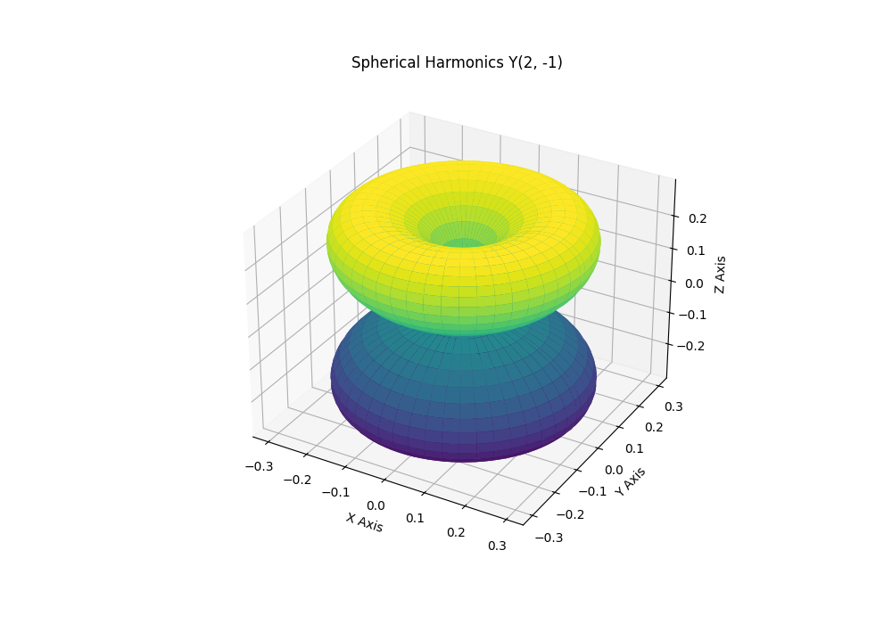
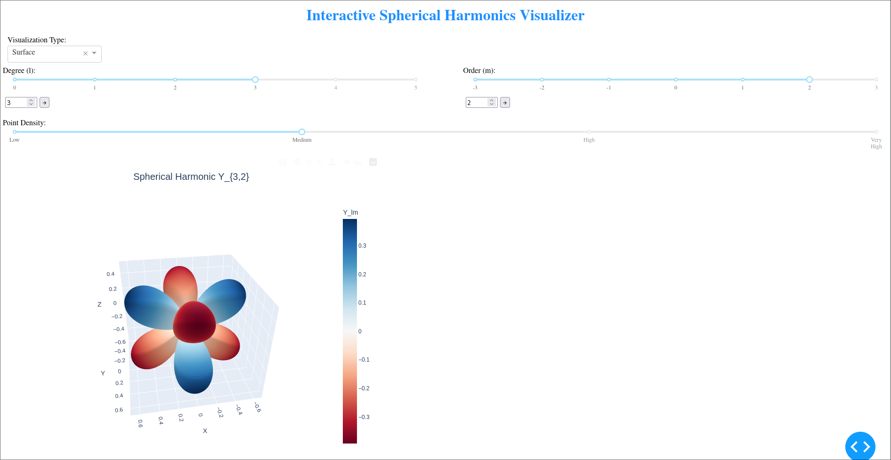

# Spherical Harmonics Plotter

"This repository contains a Python script and a Tkinter GUI application for visualizing spherical harmonics. These are important mathematical functions used in various scientific and engineering fields." -- Well that was before.

Now it contains a new Flask and dash app gui with some html as it does the plotting using plotly.

[](Figure_1.png)  
[]()  

## Introduction

Spherical harmonics are a set of special functions that form a complete and orthonormal basis for solutions to Laplace's equation in spherical coordinates. They have applications in quantum mechanics, electromagnetism, geophysics, computer graphics, and many other areas.


## Installation

1. Clone this repository:
```bash
git clone https://github.com/Shuvam-Banerji-Seal/simple-spherical-harmonics-visualizer.git
cd simple-spherical-harmonics-visualizer
```

2. Create and activate a virtual environment (recommended):
```bash
# On Windows
python -m venv venv
.\venv\Scripts\activate

# On macOS/Linux
python3 -m venv venv
source venv/bin/activate
```

3. Install the required packages:
```bash
pip install -r requirements.txt
```

## Running the Application

1. With the virtual environment activated, run:
```bash
python app.py
```

2. Open your web browser and navigate to:
```
http://127.0.0.1:8050/
```

## Usage Guide

1. **Selecting Visualization Type**
   - Use the dropdown menu to choose between Points, Surface, Wireframe, or Contour views
   - Each mode offers a different perspective on the spherical harmonic

2. **Adjusting Quantum Numbers**
   - l (Degree): Controls the overall complexity of the pattern
     - Higher l values create more complex patterns
     - Use either the slider or input box with arrow button
   
   - m (Order): Determines the azimuthal pattern
     - Range is from -l to +l
     - Controls the number of nodal planes going through the poles

3. **Point Density Control**
   - Use the density slider to adjust visualization detail
   - Higher density provides smoother visualization but may be slower

4. **Interaction Tips**
   - Click and drag to rotate the 3D view
   - Scroll to zoom in/out
   - Double-click to reset the view
   - Hover over points/surfaces to see exact values

## Mathematical Details

The spherical harmonics are computed using the formula:

Y_lm(θ,φ) = N_lm * P_lm(cos θ) * e^(imφ)

Where:
1. N_lm is the normalization factor:
   ```
   N_lm = sqrt((2l+1)/(4π) * (l-m)!/(l+m)!)
   ```

2. P_lm is the associated Legendre polynomial:
   - Special functions that arise as solutions to Legendre's differential equation
   - Implemented efficiently via SciPy's `sph_harm` function

3. The visualization shows the real part of Y_lm, as these functions are generally complex-valued

Common patterns:
- l = 0: Spherically symmetric (constant)
- l = 1: p-orbitals (dipole patterns)
- l = 2: d-orbitals (quadrupole patterns)
- m = 0: Axially symmetric around z-axis
- |m| = l: Maximum number of angular nodes

## Usage-Old tk code

1. Run the script:

   ```bash
   python spherical_harmonics_plotter.py
   ```

2. A Tkinter GUI window will appear. Enter values for the angular momentum quantum number (`l`) and the magnetic quantum number (`m`) into the designated fields.
3. Click the "Plot" button to visualize the corresponding spherical harmonic function.

## How It Works

The script follows these steps:

1. **Input**: Users provide values for `l` and `m` through the Tkinter GUI.
2. **Calculation**: The script calculates the spherical harmonics using the `sph_harm` function from `scipy.special`.
3. **Coordinate Transformation**: Spherical coordinates `(theta, phi)` are converted to Cartesian coordinates `(x, y, z)`.
4. **Plotting**: `matplotlib` is used to generate a 3D surface plot based on the calculated Cartesian coordinates.

## Equation

The spherical harmonic function for the point (0, 0) is represented by the equation:

$$Y(0, 0) = (-1)^{\max(m, 0)} \frac{2^{1 + (1 - m)!} \pi}{m! l!} \cos(\theta) e^{im\theta} \frac{4}{(1 + m)!}$$

Here's a breakdown of the equation:

- `Y(0, 0)`: The function value at the point (0, 0).
- `(-1)^{\max(m, 0)}`: The sign factor, determined by the maximum of `m` and 0.
- `2^{1 + (1 - m)!}`: A term involving the factorial of (1 - `m`).
- `\pi`: The mathematical constant pi.
- `\frac{m! l!}{m! l!}`: A normalization factor.
- `\cos(\theta)`: The cosine function of the colatitude `theta`.
- `e^{im\theta}`: The exponential term with the imaginary unit `i`.
- `\frac{4}{(1 + m)!}`: Another normalization factor.

## Example

Setting `l = 1` and `m = 0` would plot the spherical harmonic function corresponding to the ground state orbital of a hydrogen atom.

## License

This project is licensed under the MIT License - see the [LICENSE](LICENSE) file for details.
```


